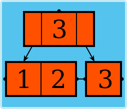

# KaosCollections

KaosCollections is a .NET library that provides generic collection classes
for storing elements that are both sorted and indexed.
Based on order statistic B+ trees,
the classes that emulate Microsoft's SortedDictionary and SortedSet
provide greater capability than their counterparts while outperforming them for large collection sizes.
Also included is a bag class and a map class.
All classes provide getting elements by index, getting the index of an element, range removal by index, range enumeration, and more.

Primary types provided are:

* `RankedDictionary<TKey,TValue>` - for collections of key/value pairs with distinct keys that can be accessed in sort order or by index.
* `RankedSet<T>` - for collections of distinct items that can be accessed in sort order or by index.
* `RankedMap<TKey,TValue>` - for collections of key/value pairs with nondistinct keys that can be accessed in sort order or by index.
* `RankedBag<T>` - for collections of nondistinct items that can be accessed in sort order or by index. Also known as multisets.

This library is built as a .NET Standard project with multitargeting to:

* .NET Standard 1.0
* .NET Framework 4.5
* .NET Framework 4.0
* .NET Framework 3.5

### Library installation

To install using Package Manager:

* **`Install-Package Kaos.Collections -Version 4.1.0`**

To install using the .NET CLI:

* **`dotnet add package Kaos.Collections --version 4.1.0`**

To install using the Visual Studio gallery:
1. Click **Manage NuGet Packages**.
2. Select package source of **nuget.org**.
3. Click **Browse** and input **Kaos.Collections**.
4. The package should appear. Click **Install**.
As a multitargeted package, the appropriate binary will be installed for your program.

To install using a direct reference to a `.dll` binary:

1. Download the `.nuget` package from either:

   * https://www.nuget.org/packages/Kaos.Collections/
   * https://github.com/kaosborn/KaosCollections/releases/

2. As archives, individual binaries may be extracted from the `.nuget` package for specific platforms.
A project may then reference the extracted platform-specific `.dll` directly.

### Project status

For the latest stable release, [install version 4.1.0](#library-installation).

Documentation for the main branch is available by building the Help project for the `.chm` output.

### Documentation

Installing as a NuGet package will provide IntelliSense and object browser documentation from the `.xml` file.
For complete documentation, see:

* https://kaosborn.github.io/help/KaosCollections/

An offline version of this documentation is also provided as a `.chm` file.
This file may need to be unblocked using the file properties dialog:

* https://github.com/kaosborn/KaosCollections/releases/

Examples, benchmarks, and roadmap may be viewed here:

* https://github.com/kaosborn/KaosCollections/wiki/

### Build

Complete source code with embedded XML documentation is hosted at GitHub:

* https://github.com/kaosborn/KaosCollections/releases/

Building the library requires Visual Studio 2017 Community Edition or greater:

* https://www.visualstudio.com/downloads/

Building documentation requires Sandcastle Help File Builder:

* https://github.com/EWSoftware/SHFB/releases/

### Repository layout

This repository is a single Visual Studio solution with additional files in the root.

* The `Bench` folder contains console program projects that mostly target the .NET 4.61 library build.
These programs exist to:

  * Provide examples for documentation
  * Exercise classes in this library
  * Benchmark performance versus Microsoft classes
  * Benchmark performance for tuning
  * Stress test
  * Show breadth first tree charts for operation sequences

* The `Collections` folder contains the primary build of the class library.
Building the Release configuration of the project contained in this folder
will produce a `.nuget` file for distribution.

* The `Collections461` folder contains a .NET 4.61 build of the class library.
This project is used for development and testing only.

* The `Help` folder contains a [Sandcastle Help File Builder](https://github.com/EWSoftware/SHFB)
project that produces documentation from embedded XML comments.
To build this project, first build `Collections461` in Release configuration.

* The `Images` folder contains the logo `.svg` file and its `.png` conversions.

* The `Source` folder contains all source code for KaosCollections.
All source is organized using shared projects which are referenced by the build projects.

* The `Test461` folder contains unit tests and some short running stress tests.
Code coverage (branch and line) is 100%.
To verify correct emulation, these tests may be run against either this library
or against the emulated BCL classes.
To run the test suite against the Microsoft classes,
add the `TEST_BCL` compilation symbol to the test project build properties.
Testing against the full framework is preferred over Core due to:

  * Decreased build times
  * Full API support
  * Support for code coverage analysis
